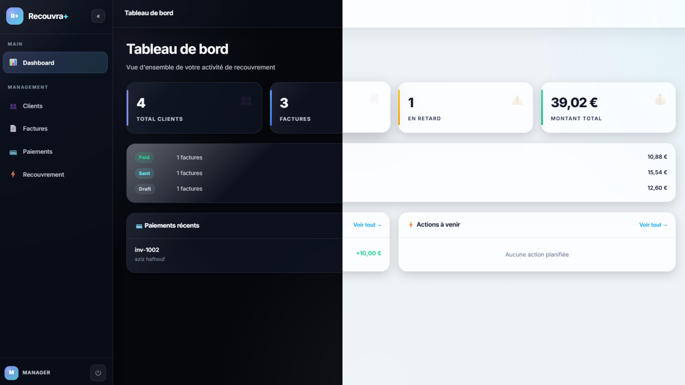
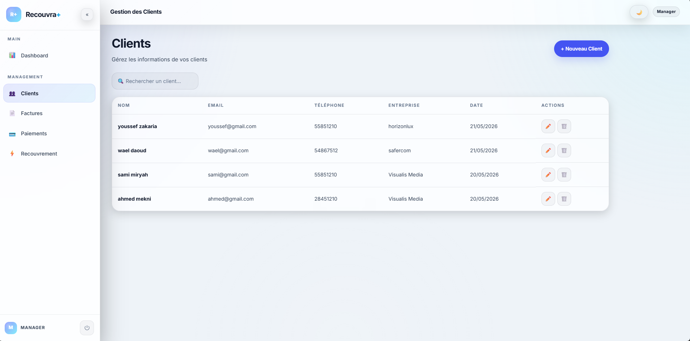
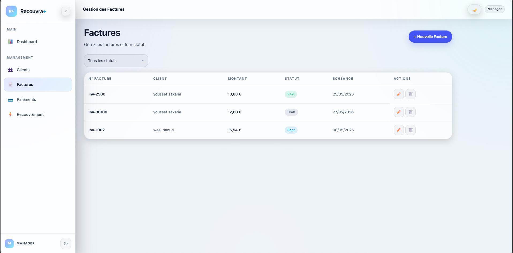
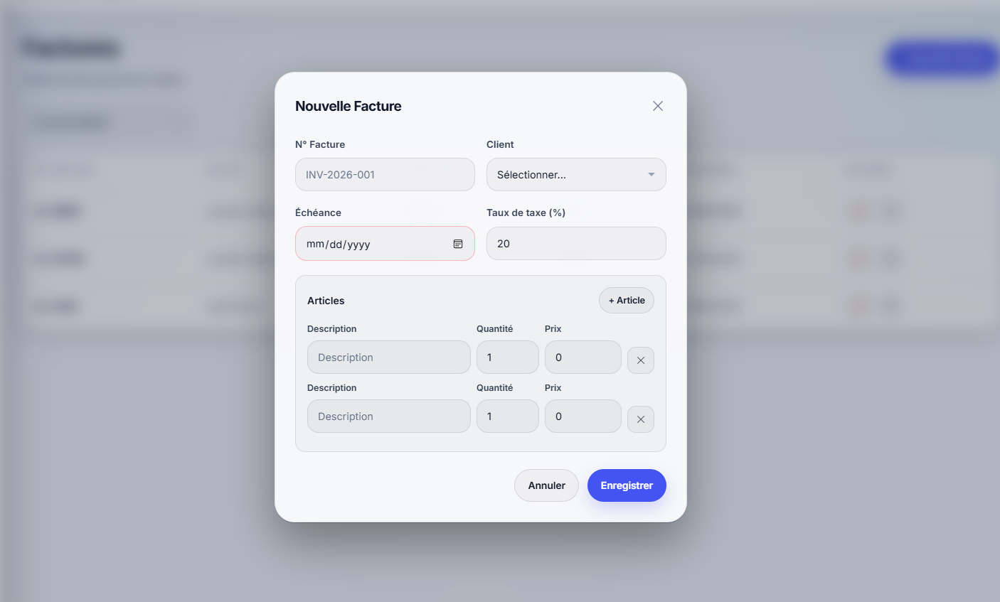

# Recouvra+ Client

> Angular application for debt recovery management — Modern frontend connected to the RecouvraApi.

---

## 📋 Project Overview

**Recouvra+** is a complete debt recovery management solution for businesses and collection firms. This frontend application, developed with **Angular 19**, offers a premium and intuitive user interface to centralize the management of debtor clients, track unpaid invoices, record payments, and plan recovery actions.

The application communicates with the **RecouvraApi** backend (Express.js / MongoDB) via a JWT-secured RESTful API.

---

## 🎯 Objectives

- **Centralize** debt management in a single, ergonomic interface
- **Automate** tracking of unpaid invoices and due dates
- **Facilitate** planning and monitoring of recovery actions (calls, emails, demand letters)
- **Secure** data access with JWT authentication system and role-based access control (Agent, Manager, Admin)
- **Provide** real-time overview via statistical dashboard

---

## ✨ Features

### Authentication & Security

- Login / Registration with validation
- Automatic JWT token management (injection via HTTP interceptor)
- Role-based access control: **Agent**, **Manager**, **Admin**
- Automatic redirection based on authentication status
- Logout with session cleanup

### Dashboard

- Statistical cards: number of clients, invoices, amounts, overdue items
- Invoice distribution by status (Draft, Sent, Paid, Cancelled)
- Recent payments list
- Upcoming recovery actions

### Client Management

- Complete list with instant search
- Creation and modification via modal
- Information: name, email, phone, company, address
- Deletion with confirmation

### Invoice Management

- List with status filter and pagination
- Creation with dynamic items (add/remove lines)
- Client selection, due date, tax rate
- Status modification (Draft → Sent → Paid / Cancelled)

### Payment Management

- Recording of payments linked to invoices
- Filter by payment method (Transfer, Check, Cash, Card)
- Tracking with reference and notes
- Pagination

### Recovery Actions

- Action planning: Email, Call, Meeting, Reminder, Demand Letter
- Tracking by status: Scheduled, Completed, Cancelled
- Next action date and result
- Filter and pagination

### Administration (Admin only)

- List of users with roles
- Account deletion

### Design & UX

- Premium dark theme with glassmorphism effects
- Indigo/violet gradients, Inter typography
- Responsive interface (desktop / tablet)
- Smooth animations and transitions
- Navigation sidebar with role indicator

---

## 📸 Screenshots

### Dashboard
Overview of all recovery management statistics and recent activities.

<div style="text-align: center; ">
  
</div>

### Client Management
Complete client list with search, filter, and CRUD operations.

<div style="text-align: center;">
  
</div>

### Invoice Management
Invoice list with status filtering, pagination, and action buttons.

<div style="text-align: center;">
  
</div>

### New Invoice Modal
Dynamic form for creating invoices with line items management.

<div style="text-align: center;">
  
</div>

---

## 🏗️ Project Architecture

```
src/
├── app/
│   ├── core/
│   │   ├── guards/              # AuthGuard, GuestGuard, AdminGuard
│   │   ├── interceptors/        # JWT Interceptor (automatic token injection)
│   │   ├── models/              # TypeScript Interfaces (User, Client, Invoice, Payment, RecoveryAction)
│   │   └── services/            # HTTP Services (Auth, Client, Invoice, Payment, RecoveryAction, Statistics, User)
│   ├── layout/                  # Main component (sidebar + navbar + router-outlet)
│   ├── pages/
│   │   ├── login/               # Login page
│   │   ├── register/            # Registration page
│   │   ├── dashboard/           # Statistical dashboard
│   │   ├── clients/             # CRUD Clients
│   │   ├── invoices/            # CRUD Invoices (with items)
│   │   ├── payments/            # CRUD Payments
│   │   ├── recovery-actions/    # CRUD Recovery Actions
│   │   └── users/               # User management (admin)
│   └── shared/
│       └── components/          # Sidebar, Navbar
├── environments/                # API Configuration (dev / prod)
└── styles.scss                  # Global theme and design system
```

---

## 🛠️ Technologies


| Technology     | Version | Role                       |
| -------------- | ------- | -------------------------- |
| Angular        | 19      | Frontend framework         |
| TypeScript     | 5.x     | Primary language           |
| SCSS           | —       | Styles and theme           |
| RxJS           | 7.x     | Asynchronous management    |
| Angular Router | 19      | Navigation and lazy loading|
| HttpClient     | 19      | REST API communication     |


---

## ⚡ Quick Installation

### Prerequisites

- **Node.js** ≥ 18
- **npm** ≥ 9
- **MongoDB** running (for the backend)
- **RecouvraApi backend** configured and started

### 1. Clone the project

```bash
git clone <repo-url>
cd recouvraClient1
```

### 2. Install dependencies

```bash
npm install
```

### 3. Configure the environment

The file `src/environments/environment.ts` points by default to:

```typescript
export const environment = {
  production: false,
  apiUrl: 'http://localhost:3001/api'
};
```

> Modify `apiUrl` if your backend is running on a different port.

### 4. Start the backend

```bash
cd "../RecouvraApi v1  mongo compass"
npm install
npm start
# → API available at http://localhost:3001
```

### 5. Launch the frontend

```bash
cd recouvraClient1
npm start 
# OR ng serve 
# → Application available at http://localhost:4200
```

### 6. Access the application

Open your browser at **[http://localhost:4200](http://localhost:4200)** and log in with an existing account or create one via the registration page.

---

## 👥 User Roles


| Role        | Access                                                           |
| ----------- | ---------------------------------------------------------------- |
| **Agent**   | Dashboard, Clients, Invoices, Payments, Recovery Actions         |
| **Manager** | Same access as Agent                                             |
| **Admin**   | Full access + User management                                    |


---

## 📡 Backend API

The application consumes the following endpoints from the RecouvraApi backend:


| Module       | Endpoint                                | Methods            |
| ------------ | --------------------------------------- | -------------------- |
| Auth         | `/api/auth/login`, `/api/auth/register` | POST                 |
| Clients      | `/api/clients`                          | GET, POST, PUT, DELETE |
| Invoices     | `/api/invoices`                         | GET, POST, PUT, DELETE |
| Payments     | `/api/payments`                         | GET, POST, DELETE    |
| Recovery     | `/api/recovery-actions`                 | GET, POST, PUT, DELETE |
| Statistics   | `/api/statistics`                       | GET                  |
| Users        | `/api/users`                            | GET, DELETE          |


> The backend must have **CORS enabled** (`app.use(cors())` in `app.js`) to authorize requests from `localhost:4200`.

---

## 📄 License

Academic project — All rights reserved.